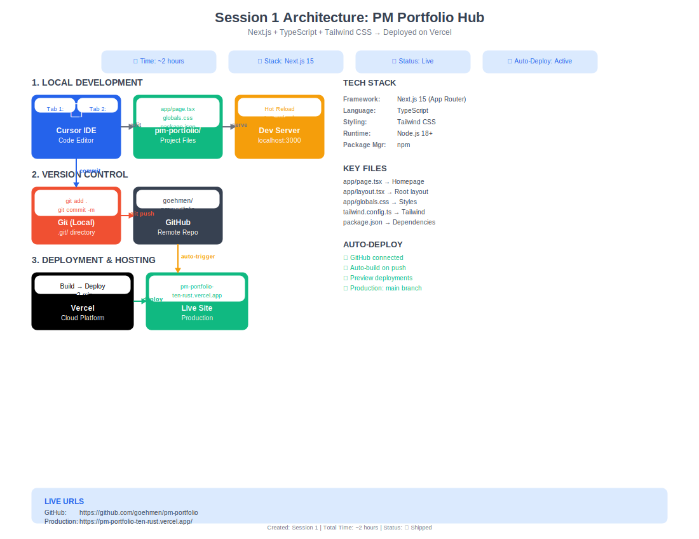

# PM Portfolio Hub

Personal portfolio site showcasing product management experience and AI-native development skills.

## 🚀 Live Site

**Production:** [https://pm-portfolio-goehmen.vercel.app/](https://pm-portfolio-goehmen.vercel.app/)

## 🏗 Architecture



*Full-stack development environment from local dev to production deployment*

## 🛠 Tech Stack

- **Framework:** Next.js 15 (App Router)
- **Language:** TypeScript
- **Styling:** Tailwind CSS
- **Deployment:** Vercel (auto-deploy from main branch)
- **Version Control:** Git + GitHub
- **Form Handling:** Formspree
- **AI Development:** Claude Sonnet 4.5/Opus 4.6
- **IDE:** Cursor  2.4.28

## 📦 Project Structure

```
pm-portfolio/
├── app/
│   ├── page.tsx          # Homepage (hero section)
│   ├── layout.tsx        # Root layout
│   └── globals.css       # Global styles + Tailwind imports
├── diagrams/
│   └── pm-portfolio-hub_session1_architecture.svg
├── public/               # Static assets
├── package.json          # Dependencies
└── README.md            # This file
```

## ✨ Features

### **Completed:**
- ✅ **Hero Section** - Professional headline with value proposition
- ✅ **About Section** - Career summary with 4 skill areas (Cloud Platforms, Fintech, AI Strategy, Developer Tools)
- ✅ **Projects Section** - 1 live project (gregoehmen.io) + 3 coming soon placeholders
- ✅ **Contact Form** - Formspree integration with spam protection
- ✅ **Footer** - 4-column responsive layout (About, Quick Links, Connect, Tech Stack)
- ✅ **Responsive Design** - Mobile-first, works on all devices
- ✅ **CI/CD Pipeline** - Auto-deploy from GitHub to Vercel
- ✅ **Architecture Documentation** - SVG diagram with full system overview

### **In Progress:**
- 🔄 Replace placeholder projects with real case studies
- 🔄 Add project screenshots/demos

## 🚀 Getting Started

### Prerequisites
- Node.js 18+
- npm

### Local Development
```bash
# Install dependencies
npm install

# Start dev server
npm run dev
```

Open [http://localhost:3000](http://localhost:3000) in your browser.

The page auto-updates as you edit `app/page.tsx`.

## 📝 Deployment

Automatically deployed via Vercel when code is pushed to the `main` branch.

**Deployment flow:**
1. Push to GitHub → 2. Vercel detects changes → 3. Builds & deploys → 4. Live in ~2 minutes


## 📊 Development Stats

- ⏱ **Build Time:** ~6-8 hours across 4 sessions
- 🎯 **Sessions:** Hero → About/Skills → Projects → Contact/Footer
- ✅ **Status:** V1 Complete - Live and deployed
- 🔄 **Auto-Deploy:** Active (GitHub → Vercel)
- 📱 **Mobile Responsive:** Yes
- 🤖 **AI-Assisted:** Built with Claude Sonnet 4.5 + Cursor IDE

## 🎯 Roadmap

### **V2 (Planned):**
- [ ] Replace "Coming Soon" cards with real project case studies
- [ ] Add project screenshots and live demos
- [ ] Add headshot to About section
- [ ] Implement smooth scroll navigation
- [ ] Add Vercel Analytics for visitor tracking
- [ ] Custom domain configuration

### **V3 (Future):**
- [ ] Blog section with MDX content
- [ ] Testimonials section
- [ ] Dark mode toggle
- [ ] Resume download link
- [ ] CMS integration (Contentful or Sanity)
- [ ] Advanced animations and transitions

## 🧑‍💻 Development Notes

This project demonstrates:
- **Modern Full-Stack Development:** Next.js 15 with App Router, TypeScript, Tailwind CSS
- **AI-Native Workflows:** Built with Claude AI assistance for code generation and architecture
- **DevOps Best Practices:** Git workflow, CI/CD automation, production deployment
- **Responsive Design:** Mobile-first approach with Tailwind breakpoints
- **Form Handling:** Third-party integration (Formspree) without backend code
- **Documentation:** Architecture diagrams, clean commit history, professional README

### **Key Learnings:**
- Time-boxing sessions accelerates delivery
- AI tools (Claude + Cursor) significantly speed up iteration
- Vercel's zero-config deployment enables rapid prototyping
- Tailwind CSS utility classes reduce custom CSS by 90%+

## 📞 Contact

**Live Contact Form:** [https://pm-portfolio-goehmen.vercel.app/#contact](https://pm-portfolio-goehmen.vercel.app/#contact)

**Connect:**
- LinkedIn: [linkedin.com/in/grego](https://www.linkedin.com/in/grego)
- GitHub: [github.com/goehmen](https://github.com/goehmen)
- Website: [gregoehmen.io](https://gregoehmen.io)

---

**Built by Greg Oehmen** | [GitHub](https://github.com/goehmen) | [Live Site](https://pm-portfolio-goehmen.vercel.app/)
